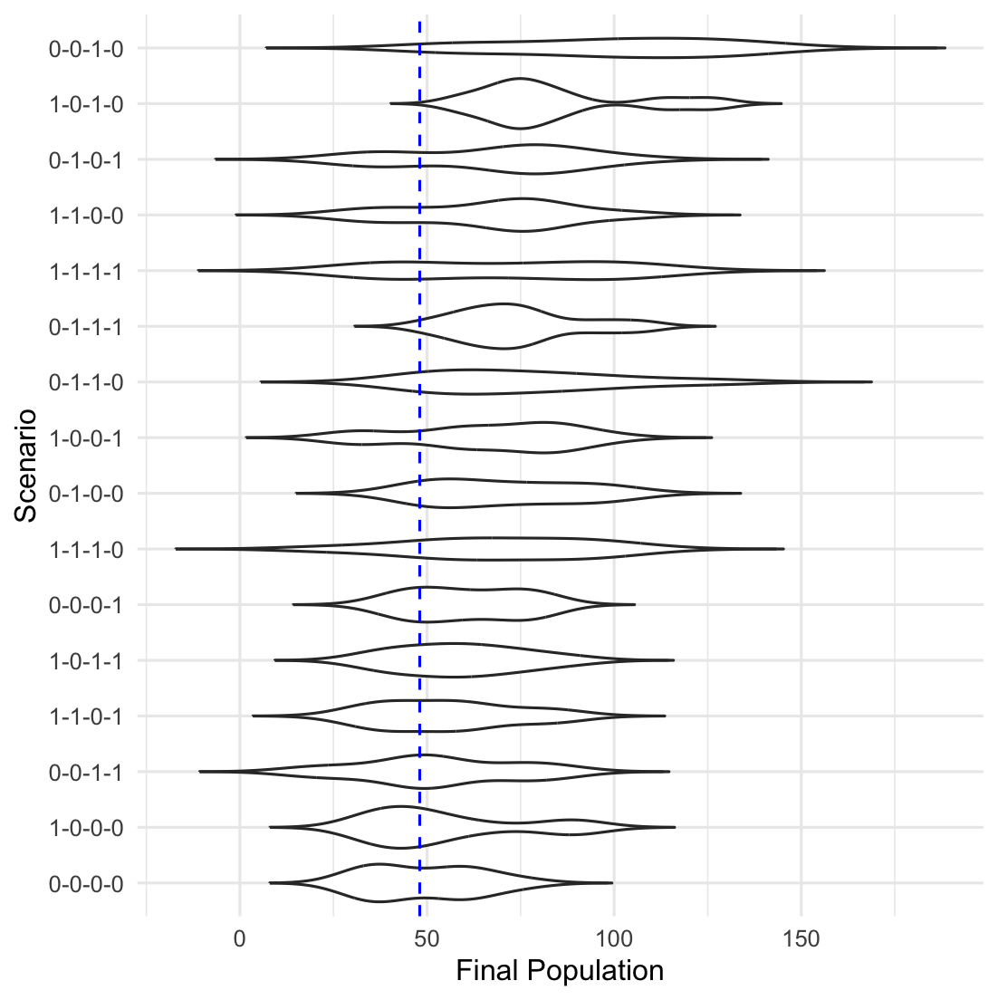
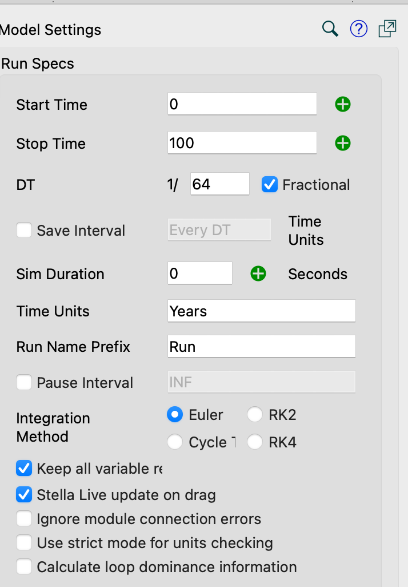
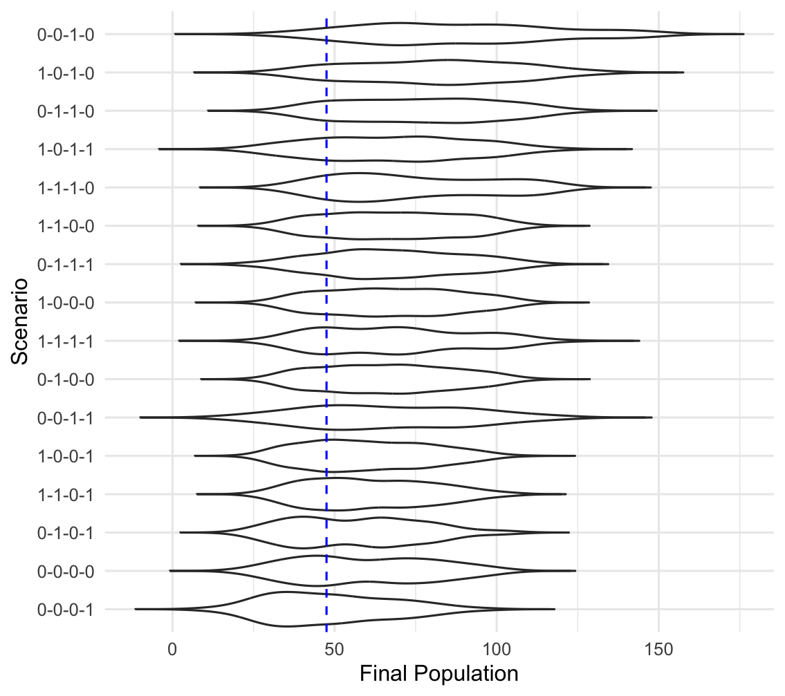

# <Description of exercise>

Provide an overview of what the exercises are about and what people will learn

# Exercises

## 1. First exercise in set

```         
inline code that can be copied and pasted 
```

## 2. Second exercise in set

```         
inline code that can be copied and pasted
```

Figure 1. k=10



## 3. Third exercise in set

```         
inline code that can be copied and pasted 
```

{width="350"}



# On your own

things that can be done beyond the exercise

# Some things to note

comments/notes

# References

any references
